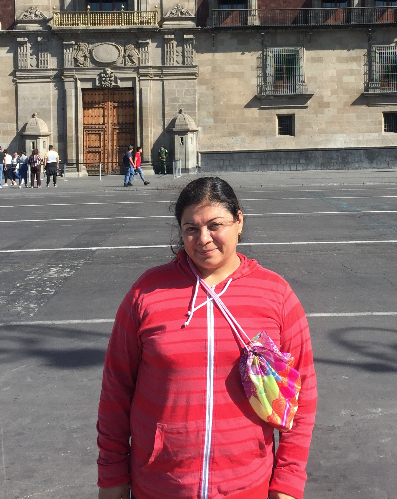

- 👋 Hi, I’m @Nayatzin  
- 👀 I’m interested in Inteligencia artificial 
-  🌱 I’m currently learning Tecnología educativa 
- 💞️ I’m looking to collaborate on proyectos educativos y editoriales 
- 📫 How to reach me nayatzingarrido@uninnova.mx 
- 😄 Pronouns: ella 
- ⚡ Fun fact: Me gusan los caballos 

<!---
Nayatzin/Nayatzin is a ✨ special ✨ repository because its `README.md` (this file) appears on your GitHub profile.
You can click the Preview link to take a look at your changes.
--->
